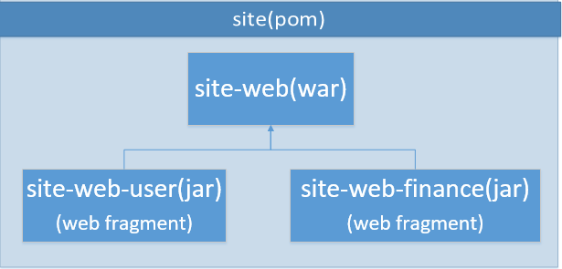
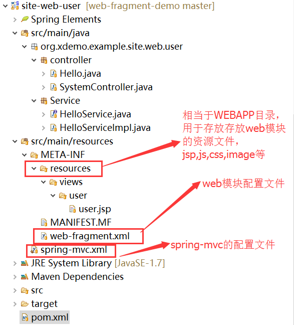

##### JavaEE6.0
              可扩展性：Web分片和可插拔  
	  Servlet 3.0的异步处理 	
Web应用程序开发人员通常在他们的应用程序中使用第三方框架，如Apache Wicket或Spring MVC。
为了使用这些框架，开发人员需要在Web应用程序中注册要使用的框架，一般都使用Web.xml文件来保存注册信息，这
个文件还包括构成Web应用程序的Web组件部署描述符，这样使得Web.xml变得非常庞大，难以隔离和维护各种描述符。
Web分片是Servlet 3.0中引入的一个新技术，通过模块化部署描述符解决了这个问题，一个Web分片可以看作是Web.xml文件的一个逻辑段，
可以存在多个Web分片，每个分片代表一个逻辑段，Web分片集可以组成一个完整的Web.xml文件，
Web.xml文件这种逻辑分区让Web框架自己可以在Web容器中完成注册。你在Web应用程序中使用的每个Web框架可以在一个Web分片中定义所有它需要的工具，
如Servlet和监听器，不再需要在Web.xml文件中添加信息。
Servlet 3.0支持对部署描述符的绝对排序和相对排序，在Web.xml文件中使用<absolute-ordering>元素指定绝对排序，
在web-fragment.xml文件中使用<ordering>元素指定相对排序

#### 演示项目的目的：

使用web模块化技术，测试web模块之间的调用，模块间资源的相互使用。

#### 演示项目的结构图:


	
模块具体解释如下：	

site:maven parent module,用来管理site-web,site-web-user,site-web-finance三个子模块。
site-web:主要是配置SpringMVC的前端控制器，以及配置log4j的日志在web.xml中。依赖site-web-user和site-web-finance2两个模块。
site-web-user:包含了web-fragment.xml配置，以及spring-mvc.xml的配置加载。

site-web-finance:包含了web-fragment.xml配置，以及spring-mvc.xml的配置加载。依赖site-web-user模块（调用了HelloService）。

#### 项目演示
部署site-web到本地web服务器,可进行如下url的访问：
访问site-web模块下的index.jsp-->http://localhost:8080/site-web/
访问site-web-user模块下的Hello.java-->http://localhost:8080/site-web/hello
访问site-web-user模块下SystemController.java-->http://localhost:8080/site-web/system/update
访问site-web-finance模块下Finance.java-->http://localhost:8080/site-web/finance
访问site-web-finance模块下FinanceController.java-->http://localhost:8080/site-web/finance_spring/test

#### web模块化使用的注意事项

web模块必须用web-fragment文件存放在根路径下的META-INF文件夹下。
web模块的资源必须存放在META-INF下的resources文件夹下。

#### web-fragment.xml文件模板
```
<?xml version="1.0" encoding="UTF-8"?>
<web-fragment 
	xmlns="http://java.sun.com/xml/ns/javaee"  
    xmlns:xsi="http://www.w3.org/2001/XMLSchema-instance"  
    xsi:schemaLocation="http://java.sun.com/xml/ns/javaee 
    http://java.sun.com/xml/ns/javaee/web-fragment_3_0.xsd" 
    version="3.0">  
   
</web-fragment> 

```
#### web.xml文件模板
```
<?xml version="1.0" encoding="UTF-8"?>
<web-app  
	xmlns="http://java.sun.com/xml/ns/javaee" 
	xmlns:xsi="http://www.w3.org/2001/XMLSchema-instance" 
	xsi:schemaLocation="http://java.sun.com/xml/ns/javaee                       
	http://java.sun.com/xml/ns/javaee/web-app_3_0.xsd"
	version="3.0">

</web-app>

```
